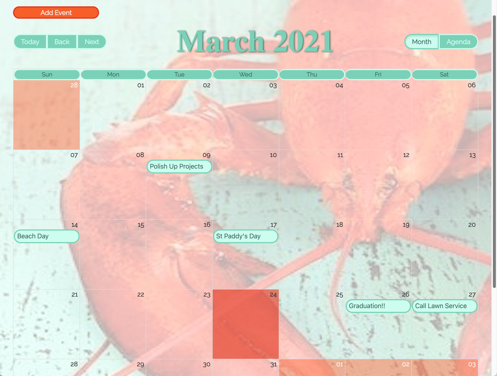

# Life's BIG Calendar

> This calendar app demonstrates the skills acquired, while attending SDG Full Stack BootCamp, in just 3 months! This assignment uses the React Big Calendar template to create a CRUD base application.

Visit Life's BIG Calendar live @:

https://lifes-big-calendar-capstone.herokuapp.com/

Technologies used:

- Back End:
  - C# to build API
  - LINQ and Entity Framework
- Front End:
  - Javascript
  - HTML/CSS
  - React using Hooks
  - React Router to support multiple pages

Note:

- additional features will eventually include:
  - clicking on date to create event
  - event color associations
  - including additional images and icons
